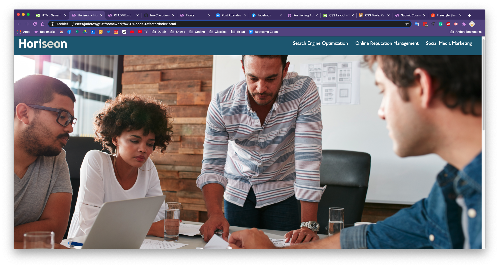

# hw-01-code-refactor

## Description 

This is the homepage for Horiseon Social Solution Services. I was provided with a completed web page, but the HTML for the page was not ideal as it did not take advantage of semantic elements. I improved the semantics without making any changes to the functionality or appearance of the website.

## Syntax changes made in HTML

Please note that none of these changes affected the appearance or functionality of the web page in any way. Still, replacing the generic element "div" with a more self explanatory semantic element makes one's code easier to read, understand, and edit.

I have added comments in the HTML file to show where changes were made.

* &lt;div class="header"&gt; became **&lt;header&gt;**
* &lt;div&gt; that contains navigation links became **&lt;nav&gt;**
* &lt;div&gt; that contains the main page background image became **&lt;figure&gt;**
* &lt;div class="content"&gt; became **&lt;main&gt;**
* The &lt;main&gt; part of the page contains three smaller sections which were at first defined by &lt;div&gt;s but I changed them to **&lt;section&gt;**s.
* The &lt;div&gt; that floats to the right of the page became an **&lt;aside&gt;**, which also contains three &lt;section&gt;s
* &lt;div class="footer"&gt; became **&lt;footer&gt;**
* Added **alt descriptions** to every image, improving the page accessibility.
* **CSS selectors** were also updated accordingly to maintain styling.

## Redundant use of classes in CSS
The CSS for this web page did not initially make efficient use of classes. Each &lt;section&gt; element in the page was individually targeted with its own class even though they shared the same styling. The ideal way to use a class in this case is to _use one class for all elements that share the same styling_. 

* In the &lt;aside&gt; of the page, the classes .benefit-lead, .benefit-brand, and .benefit-cost were all reconciled into **.asideStyling**.
* In the &lt;main&gt; of the page, the classes .search-engine-optimization, .online-reputation-manaement, and .social-media-marketing with one class **.mainStyling**.

## Screenshot of page

## URL

You can view the deployed site at https://judeclark19.github.io/hw-01-code-refactor/